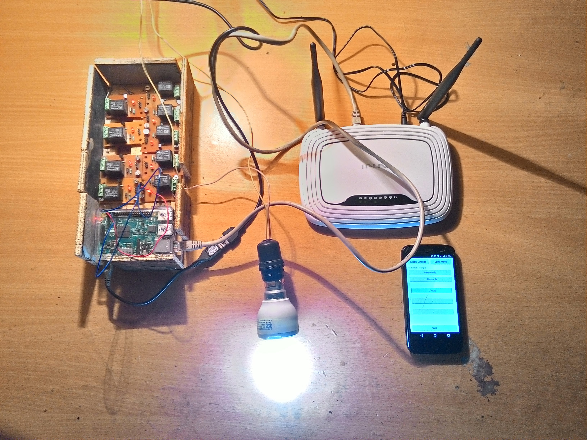

# SmartSwitch RaspberryPi Controller

## Overview
SmartSwitch RaspberryPi Controller is a Raspberry Pi application created as a part of Home Automation Project.

This application receives data from local network or through internet and based on messages switches on or off
the required switches which are connected to.

Some part of code has been modified in order to hide identifiable information (like IP address, MAC address
and Web address).

## Installation

#### Build requirements
Qt Framework v4

## LICENSE
SmartSwitch RaspberryPi Controller is licensed under the GPL v2. See file LICENSE for more information.

## Copyright
All Copyrights are owned by their respective owners.
